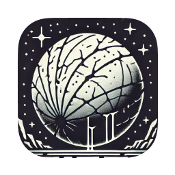

# Contact Abyss

## Overview

**Contact Abyss** is an immersive text-based adventure game developed using Flutter for iOS and a
native WatchOS companion app. In this game, players take on the role of a probe sent to explore
Europa's subsurface ocean, making critical decisions based on sensor data, environmental challenges,
and limited battery power to uncover potential signs of extraterrestrial life.

This project serves as a practical example for the article "Creating a WatchOS Companion App for a
Flutter iOS Mobile App." The game demonstrates how to establish a robust communication channel
between the Flutter-based iOS app and the WatchOS companion app using Method Channels and the
`WCSession` class. By illustrating the synchronization of game progress between the two platforms,
this project provides a comprehensive guide for developers looking to enhance their apps with
seamless cross-device functionality.

## Features

- **Cross-Platform Gameplay**: Play the game on your iPhone or Apple Watch, with real-time
  synchronization of game progress between both devices.

- **Interactive Narrative**: Engage in a rich, story-driven experience where your choices directly
  impact the mission's outcome.

- **Sensor Data Integration**: Receive and interpret simulated sensor readings to guide your
  exploration and decision-making.

- **Battery Management**: Strategically manage limited battery resources to ensure mission success
  and data transmission back to Earth.

- **Seamless Communication**: Utilize Method Channels and WCSession to sync game states, ensuring a
  consistent experience across iOS and WatchOS platforms.

- **Environmental Challenges**: Navigate through Europa's harsh subsurface environment, overcoming
  obstacles such as ice fractures, radiation surges, and underwater currents.

## Communication Between iOS and WatchOS Apps

This project demonstrates how to establish effective communication between a Flutter-based iOS app
and a native WatchOS companion app. The key components include:

- **Method Channels**: Facilitate bi-directional communication between Dart (Flutter) and Swift (
  WatchOS) codebases, allowing the exchange of messages and data.

- **`WCSession` Integration**: Leverage Apple's `WCSession` class to handle message transfers
  between the iOS and WatchOS apps, ensuring real-time synchronization of game states.

- **State Synchronization**: Automatically update game progress, sensor data, and other relevant
  information across both devices, enabling players to switch seamlessly between their iPhone and
  Apple Watch without losing progress.

## Usage

Players can begin their mission on either their iPhone or Apple Watch. The game state, including the
current node, sensor data, and battery level, is synchronized between both devices, allowing
seamless gameplay. Key interactions include:

- **Initiating Missions**: Start drilling through Europa's ice or perform preliminary scans.

- **Making Strategic Decisions**: Based on sensor data, choose actions that balance mission
  objectives with battery conservation.

- **Handling Obstacles**: Navigate through environmental challenges such as ice fractures, radiation
  surges, and underwater currents.

- **Data Transmission**: Manage communication capabilities to transmit findings back to Earth before
  battery depletion.

## Communication Synchronization

The core of the synchronization mechanism involves:

1. **Method Channels in Flutter**: Define Method Channels to communicate with native Swift code on
   WatchOS.

2. **`WCSession` in WatchOS**: Implement WCSession to handle message passing between the WatchOS app
   and the iOS app.

3. **Game State Management**: Ensure that any changes in the game state (e.g., current node, battery
   level) are sent from one device to the other in real-time, maintaining consistency.

## Example Workflow

1. **Starting the Game**: Launch the game on your iPhone or Apple Watch. The game state initializes
   at the start node.

2. **Making Choices**: As you make decisions, the game state updates with sensor data and battery
   levels.

3. **Switching Devices**: If you switch from your iPhone to your Watch, the WatchOS app retrieves
   the current game state, allowing you to continue seamlessly.

4. **Data Synchronization**: Actions taken on one device are immediately reflected on the other,
   ensuring that gameplay remains consistent regardless of the platform used.

