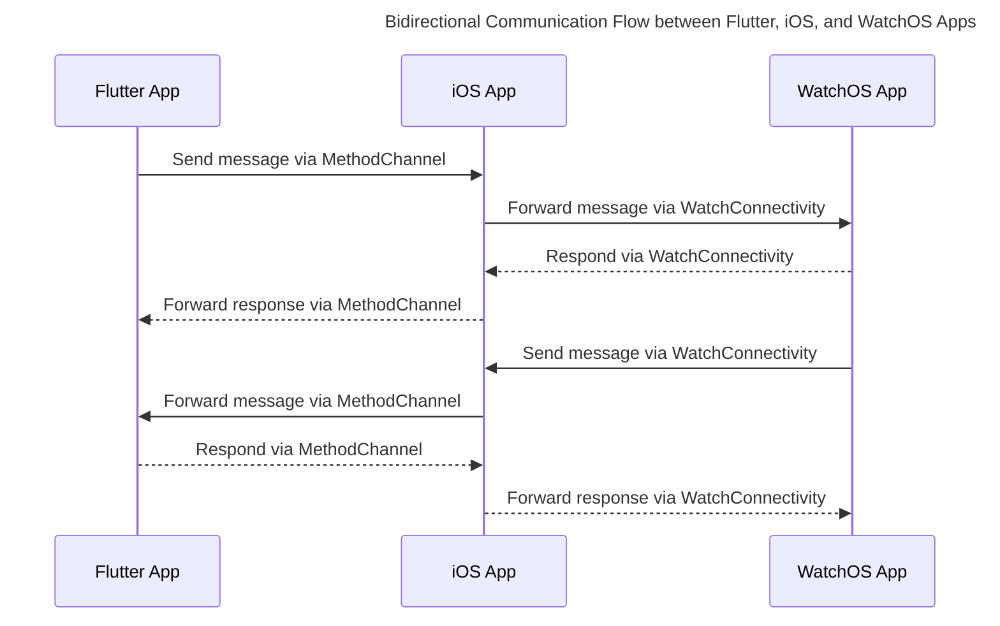

# Flutter-WatchOS Communication Architecture

## Table of Contents

1. [Introduction](#introduction)
2. [Architecture Overview](#architecture-overview)
3. [Communication Flow](#communication-flow)
    - [From WatchOS App to Flutter](#from-watchos-app-to-flutter)
    - [From Flutter to WatchOS App](#from-flutter-to-watchos-app)

---

## Introduction

Building a **WatchOS companion app** for a **Flutter** project requires communication between the
Dart codebase and the native Swift code so that the Flutter iOS app and the WatchOS companion app
can exchange information. This document explains the communication architecture that enables
information to be exchanged among the Flutter app, the iOS intermediary, and the WatchOS companion
app.

---

## Architecture Overview

The communication architecture is designed to facilitate bidirectional data exchange between the *
*Flutter (Dart)** app and the **WatchOS** app through the **iOS** native code acting as an
intermediary. This ensures that both platforms can send and receive messages, maintaining
synchronization and responsiveness.

## Architecture Overview

Below is a Mermaid sequence diagram that illustrates the bidirectional communication flow between
the **Flutter App**, the **iOS App**, and the **WatchOS App**. This diagram provides a high-level
overview of how messages are transmitted and received across the different components.

## Communication Flow

### From WatchOS App to Flutter

1. **ViewModel Invocation**:
    - A **ViewModel** in the WatchOS app (e.g., `LoadingViewModel`) calls a method from the *
      *CommunicationService** (e.g., `requestCurrentGameNode`).

2. **CommunicationService Sends Message**:
    - **CommunicationService** constructs a message dictionary and sends it to the iOS app via
      `WatchConnectivityHandler`.

3. **iOS App Receives Message**:
    - **WatchConnectivityHandler** receives the message through `WCSessionDelegate` methods and
      forwards it to Flutter using `WatchOSMethodChannelHandler`.

4. **Flutter Processes Message**:
    - **WatchOSCommunicationService** in Flutter listens on the `MethodChannel` for incoming
      messages, processes the request (e.g., fetching the current game node), and sends a response
      back.

5. **iOS App Forwards Response**:
    - **WatchConnectivityHandler** receives the response from Flutter and sends it back to the
      WatchOS app via the `replyHandler`.

6. **CommunicationService Handles Response**:
    - **CommunicationService** receives the response and invokes the completion handler to update
      the ViewModel.

### From Flutter to WatchOS App

1. **Flutter Initiates Communication**:
    - **WatchOSCommunicationService** in Flutter sends a message via `MethodChannel` to the iOS app.

2. **iOS App Receives Message**:
    - **WatchOSMethodChannelHandler** receives the message from Flutter and forwards it to the
      WatchOS app using `WatchConnectivityHandler`.

3. **WatchOS App Receives Message**:
    - **CommunicationService** in the WatchOS app receives the message through `WatchConnectivity`
      and updates the ViewModel accordingly.

4. **ViewModel Updates UI**:
    - The **ViewModel** processes the received data and updates the SwiftUI views to reflect
      changes.